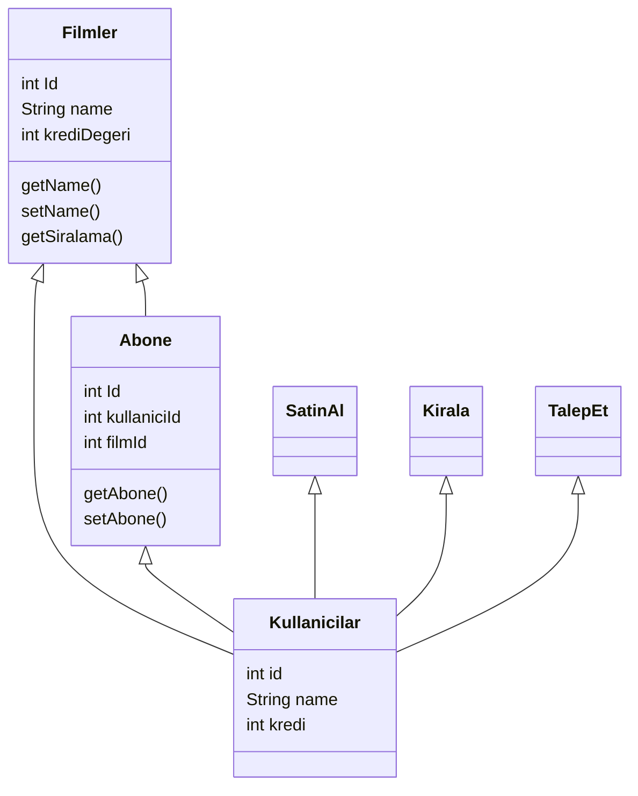

```mermaid
classDiagram
    Filmler <|-- Abone
    Filmler <|-- Kullanicilar
    Abone <|-- Kullanicilar
    SatinAl <|-- Kullanicilar
    Kirala <|-- Kullanicilar
    TalepEt <|-- Kullanicilar
 
    
    class Filmler{
    int Id
    String name
    int krediDegeri
    getName()
    setName()
    getSiralama()        
    }
    class Abone{
       int Id
       int kullaniciId
       int filmId
       getAbone()
       setAbone()
    }
    class Kullanicilar{
        int id
        String name
        int kredi
    }
    class SatinAl{
    }
    class Kirala{
    }
    class TalepEt{
    }
```
